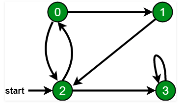

# Data Structures Using java:


## BFS and DFS - Graph Traversal algorithm

[Video Link](https://www.youtube.com/watch?v=pcKY4hjDrxk)

### BFS
- In BFS - visit a vertex and explore all connected vertex then visit other vertex and explore all connected vertex for that node and so on
- BFS - uses queue DS
- In tree - BFS is level order traversal
- Slower
- Good to use BFS when solution is near to source
- BFS spanning tree
- TC : (V^2) when adjacency matrix is used

### DFS
- In DFS - visit a vertex and explore next connected vertex and so on untill u get no conneted node
- BFS - uses stack DS
- In tree - DFS is level pre-order traversal
- Faster
- Good if solution is away from source
- DFS spanning tree
- dotted lines are back edges
- TC : (V^2) when adjacency matrix is used

---

- Graph example:



- BFS Traveral : 2, 0, 3, 1
- DFS Traversal: 2, 0, 1, 3

- BFS implementation java:
```java

import java.io.*;
import java.util.*;

Class Graph{

private int nun_vertex;
private LinkedList<Integer> adjacencyList[];

Graph(int v){
  nun_vertex = v;
  adjacencyList = new LinkedList[v];
  for(int i=0;i<v;i++){
    adjacencyList[i] = new LinkedList();
  }
  
  void addEdge(int v, int w){
    adjacencyList[v].add(w);
  }
  
  void BFS(int start){
    
  
  }
  

}


}

public static void main(String args[]){
  Graph gh = new Graph(4);
  
  gh.addEdge(0, 1);
  gh.addEdge(0, 2);
  gh.addEdge(1, 2);
  gh.addEdge(2, 0);
  gh.addEdge(2, 3);
  gh.addEdge(3, 3);
  
  System.out.println("BFS: Start with vertest 2");
  gh.BFS(2);
}
```


