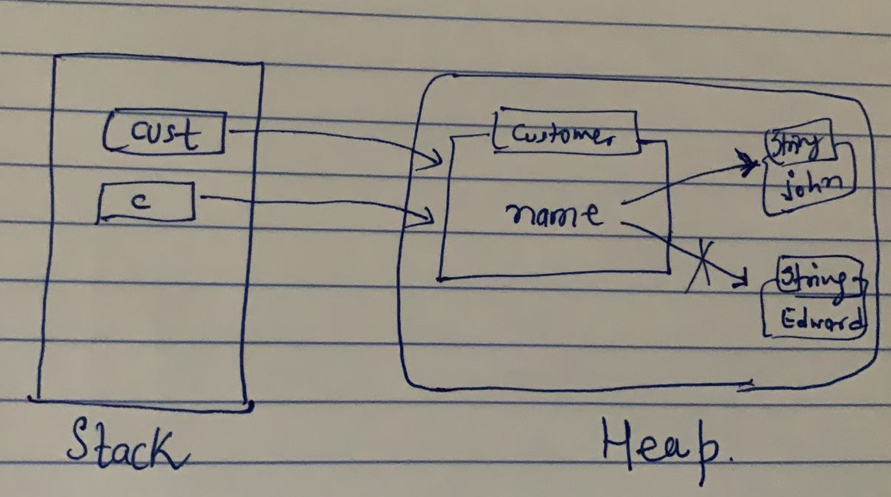

# Statck Memory in java

- Stack memory in java is used for static memory allocation and execution of a thread
- All local primitive variables, threads, contants, reference variables, methods, reference of objects use stack memory
- stack is for short time
- its automatically allocated and deallocated when method finishes execution
- if this memory is full, java throws java.lang.StackOverFlowError
- Access to this memory is fast as comapred to heap memory
- This memory is threadsafe as each thread operates in its own stack

Ex.
```java
public class Main{
  public static void main(String[] args){
    int number = 7;
    value = processData(number);
  }

  public static int processData(int data){
    int tempNumber = data + 3;
    int newNumber = tempNumber * 2;
    return newNumber;
  }
}
```


---

# Heap Memory in java

- Heap space in java is used for dynamic memory allocated for java objects and JRE classes at the runtime.
- Heap - broken into 3 parts - young genration, old generation and permanent generation
- it accessed via complex memory management technique that include Young generation, old generation, Permanent generation
- If heap space is full, java throws java.lang.OutOfMemoryError (OOM)
- Access to this memory is relatively slower than stack memory
- This memory isn't automatically deallocated. It needs Garbage collector to free up unused objects so as to keep the efficiency of memory usage
- Heap isn't thread safe and needs to be guarded by properly synchronizing the code

Ex.
```java
public static void main(String[] args){
  List<String> myList = new ArrayList<String>();
  myList.add("one");
  myList.add("Two");
  myList.add("Three");
  printList(myList);
}

public static void printList(List<String> data){
  String value = data.get(1);
  data.add("Four");
  System.out.println(value);
}
```


---

# Process and Threads


- Every Single process has minimum one thread
- Thread can be created by extending Thread class or Runnable interface, Runnable interface is more preferrable.
- 

```java
Class NewYear implements Runnable{
  public void run() {
    countDown();
  }
  
  public void countDown() {
    for(int i = 10; i>0; i--){
      System.out.println(i);
      try {
        Thread.sleep(1000);
      }
      catch (InterruptedException e) {
        e.printStackTrace();
      }
    }
    System.out.println("Happy New Year!");
  }

}

public class Main {
  public static void main(String[] args) {
    NewYear ny = new NewYear();
    Thread t = new Thread(ny);
    t.start();
  }

}
```

# Passing by Value vs Reference

- java does not allow passing variables by reference 
- java allow only passing variables by value, which is copy of the variable
- there is no ref keyword in java
- java can do ref thing by wrapping into a class and return the instance of class
- For objects passed into methods, the REFERENCE to the object is passed BY VALUE
-

```java
public static void main(String[] args){
  int localValue = 5;
  calculate(localValue);
  System.out.println(localValue); // it prints 5
}

public static void calculate(int calcValue){
  calcValue = calcValue * 100;
}

---
public static void main(String[] args){
  Customer c = new Custome("Edward");
  renameCustomer(c);
  System.out.println(c.getName()); // it will print John
}

public static void renameCustomer(Customer cust){
  cust.setName("John");
}

```


# final keyword
```java
final Customer c = new Custome("Edward"); // can't be chnage again

final Customer c;
c =  new Custome("Sam"); // fine
c =  new Custome("James"); // compiler error
c.setName("James"); //fine

```


